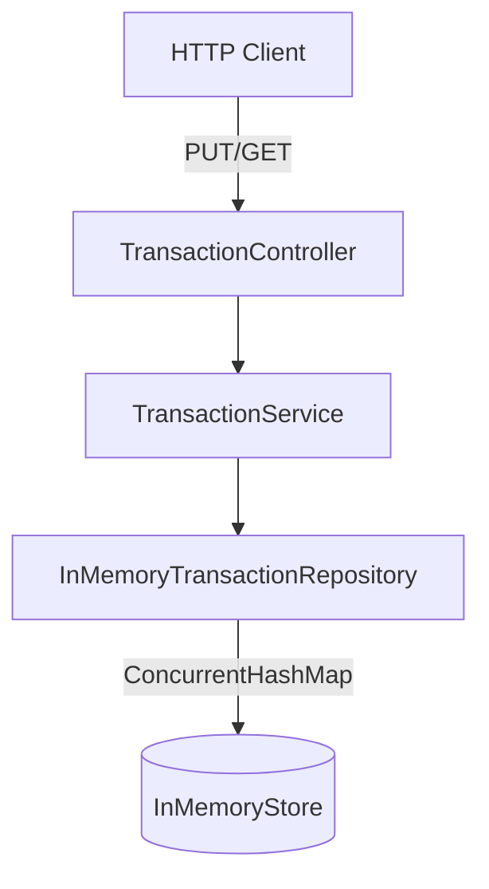

# Technical design

Design decisions for the transactions REST service.
Full specification in [`challenge-prd.md`](challenge-prd.md). Roadmap in [`plan.md`](plan.md).

**Stack:** Java 21 + Spring Boot 3.x + Gradle

---

## Domain model

```java
record Transaction(long id, double amount, String type, Long parentId) {}
```

- `parentId` is nullable (absent in JSON = no parent).
- `id` comes from the path, not the body.
- `type` comparison is **case-insensitive**; the canonical form stored in the domain, primary map, and `byType` index is **lowercase** (e.g. `"Cars"` and `"CARS"` both become `"cars"`).
- Normalize `type` at the **API boundary** on `PUT` (request body) and `GET /types/{type}` (path segment): `trim()` then `toLowerCase(Locale.ROOT)`. Reject empty after trim with **400**.

---

## API contracts and business rules

| Case | Decision |
| --- | --- |
| `PUT` with existing ID | **Upsert** (replaces the transaction) |
| `PUT` success | **200 OK** always (create and replace); body `{ "status": "ok" }` — no `201 Created` |
| `parent_id` refers to non-existent ID | **400 Bad Request** |
| `parent_id` creates a cycle (A→B→A) | **400 Bad Request** |
| `GET /sum/{id}` with non-existent ID | **404 Not Found** |
| `GET /types/{type}` with no results | **200** with `[]` |
| Amounts | `double` per spec; validate `amount >= 0` |
| `type` comparison | **Case-insensitive**; canonical **lowercase** in domain and persistence |
| Empty `type` | **400 Bad Request** (empty or whitespace-only after `trim()`) |

### Endpoints

#### `PUT /transactions/{transaction_id}`

**Request body:**

```json
{
  "amount": 5000,
  "type": "cars",
  "parent_id": 10
}
```

- `parent_id` is optional.
- `type` in the body is normalized to lowercase before persistence (see Domain model).
- **HTTP status:** **200 OK** on every successful `PUT` (first create or replace of an existing id).
- **Response body:** `{ "status": "ok" }`

#### `GET /transactions/types/{type}`

- `{type}` in the path is normalized the same way before lookup (e.g. `GET /types/CaRs` matches transactions stored as `"cars"`).
- **Response:** JSON array of IDs, e.g. `[10, 11]`

#### `GET /transactions/sum/{transaction_id}`

- **Response:** `{ "sum": 20000.0 }`
- Includes the root transaction amount plus all its **descendants** transitively linked via `parent_id` (children, grandchildren, etc.).
- Does not include ancestors.

---

## Layered architecture



### Package structure

```
com.aleitox.transactions/
├── domain/          Transaction, domain exceptions
├── application/     TransactionService (use-case port)
├── infrastructure/  InMemoryTransactionRepository
└── api/             TransactionController, DTOs, ExceptionHandler
```

### SOLID principles applied

- **SRP:** controller handles HTTP only; service handles logic only; repository handles persistence only.
- **DIP:** `TransactionService` depends on a `TransactionRepository` interface, not the concrete implementation.
- **OCP:** add another storage backend (Redis, etc.) without touching the service.

---

## In-memory persistence

Primary store:

```java
ConcurrentHashMap<Long, Transaction> transactions
```

Auxiliary indexes (updated on every `PUT`):

| Index | Type | Used for |
| --- | --- | --- |
| `byType` | `Map<String, Set<Long>>` | `GET /transactions/types/{type}` |
| `childrenByParent` | `Map<Long, List<Long>>` | `GET /transactions/sum/{id}` |

On upsert with a different `type` or `parent_id`, recalculate both indexes for the affected transaction.

`byType` keys always use the canonical lowercase `type` (never mixed-case variants).

---

## Transitive sum algorithm

For `GET /sum/{id}`:

1. Verify the root transaction exists.
2. Traverse descendants using `childrenByParent` (BFS or DFS).
3. Sum `amount` of the root + all descendants.

Complexity: O(number of descendants), without scanning the entire store.

---

## Error handling

Domain exceptions:

- `TransactionNotFoundException` → 404
- `InvalidParentException` (non-existent parent or cycle) → 400

Centralized `@RestControllerAdvice` for consistent JSON responses.

---

## Testing strategy

### Integration tests (required)

`@SpringBootTest` + `MockMvc`, covering:

1. **Happy path from the spec:** 3 PUTs + GET types + GET sum.
2. **GET /types/{type}** with no results → `[]`.
3. **GET /sum/{id}** with non-existent ID → 404.
4. **PUT** with non-existent `parent_id` → 400.
5. **PUT** that would create a cycle in the hierarchy → 400.
6. **`type` case-insensitivity:** `PUT` with mixed-case `type` and `GET /types/{type}` with different casing return the same IDs (e.g. store `"Shopping"`, query `/types/shopping`).

### Unit tests (optional, valued)

Service isolated with a mocked repository for cycle validation and business rules.

### Approach

Incremental TDD per endpoint (see phases 2.3–2.5 in [`plan.md`](plan.md)).

---

## Docker infrastructure

- Multi-stage `Dockerfile`: Gradle build + JRE 21 slim runtime.
- Optional `docker-compose.yml` to start with a single command.
- Exposed port: `8080`.
