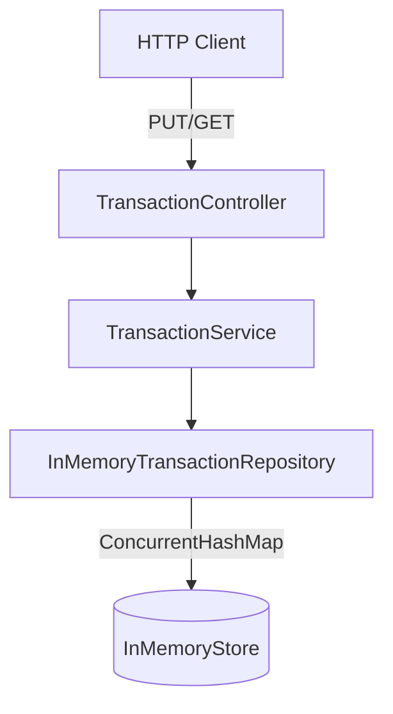
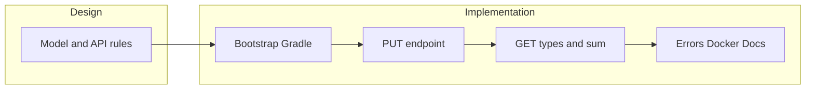

# Execution plan

**Chosen stack:** Java 21 + Spring Boot 3.x + Gradle

**Documentation in the repo:**


| File                                    | Purpose                                                          |
| --------------------------------------- | ---------------------------------------------------------------- |
| `README.md`                             | Repo entry point (initial stub; completed after implementation)  |
| `docs/challenge-prd.md`                 | Original challenge specification (PRD)                           |
| `docs/plan.md`                          | Execution plan (roadmap, phases, acceptance criteria)            |
| `docs/design.md`                        | Technical design decisions (API rules, architecture, algorithms) |
| `docs/implementation-conventions.md`    | How to implement endpoints with TDD (DTOs, validation, errors)   |


---

## Initial commit strategy

**Commit 1 — documentation**

```
docs: add challenge PRD, plan and design
```

Includes: `docs/`, `README.md` (stub), minimal `.gitignore`.

**Commit 2 — bootstrap**

```
chore: bootstrap Spring Boot project with Gradle
```

Includes: project generated with Spring Initializr, no business logic.

GitHub repo: create **empty** (no auto-generated README, `.gitignore`, or license).

---

## Functional overview

REST service that persists transactions in memory with three operations:


| Endpoint                         | Behavior                                                                                               |
| -------------------------------- | ------------------------------------------------------------------------------------------------------ |
| `PUT /transactions/{id}`         | Creates/replaces a transaction → **200 OK** + `{ "status": "ok" }` (always, no `201`)                  |
| `GET /transactions/types/{type}` | Returns a list of IDs with that type → `[10, 11, ...]`                                                 |
| `GET /transactions/sum/{id}`     | Sum of the root transaction amount + all transitive descendants via `parent_id` → `{ "sum": 20000.0 }` |


Example from the spec:

```
10 (5000, cars)
 └─ 11 (10000, shopping)
     └─ 12 (5000, shopping)

GET /transactions/sum/10  → 20000
GET /transactions/sum/11  → 15000
```




---

## Stage 1 — Design

Goal: make decisions explicit before writing code, so implementation is straightforward and architecture is easy to evaluate.

Technical details in `[design.md](design.md)`.

### Design deliverables

- [x] `docs/plan.md` with the execution plan versioned in the repo.
- [x] `docs/design.md` with business/API and architecture decisions.
- [x] Layer and flow diagram (above).
- [x] Agreed project structure skeleton.
- [x] List of integration tests to implement.

---

## Stage 2 — Implementation

Incremental development with small commits and clear messages.

### Phase 2.1 — Project bootstrap

- Generate Spring Boot 3.x project with Gradle (Java 21).
- Minimal dependencies:
  - `spring-boot-starter-web`
  - `spring-boot-starter-validation`
  - `spring-boot-starter-test`
- Configure `settings.gradle`, `build.gradle`, `.gitignore`.
- Verify `./gradlew bootRun` starts the empty app.

**Commit:** `chore: bootstrap Spring Boot project with Gradle`

### Phase 2.2 — Domain + in-memory repository

- Create `Transaction` record and exceptions (`TransactionNotFoundException`, `InvalidParentException`).
- `Transaction.type` is stored in **canonical lowercase** (see `[design.md](design.md)`); normalization happens at the API layer in phases 2.3–2.4.
- `TransactionRepository` interface + `InMemoryTransactionRepository` with `ConcurrentHashMap<Long, Transaction>`.
- Auxiliary indexes: `Map<String, Set<Long>> byType` (lowercase keys) and `Map<Long, List<Long>> childrenByParent`.

**Commit:** `feat: add domain model and in-memory repository`

### Phase 2.3 — PUT /transactions/{id} (TDD)

Follow [`implementation-conventions.md`](implementation-conventions.md).

1. Write integration test with the base example (3 PUTs → **200 OK** + `{ "status": "ok" }`).
2. Implement `TransactionController`, request DTO, `TransactionService.save()`.
3. Normalize `type` from the request body: `trim()` + `toLowerCase(Locale.ROOT)`; reject empty after trim.
4. Validations: parent exists, no cycles, required fields.
5. Update indexes on save/replace (`byType` uses canonical lowercase keys).

**Commit:** `feat: implement PUT /transactions/{id}`

### Phase 2.4 — GET /transactions/types/{type}

1. Test: after the 3 PUTs from the example, `GET /types/cars` → `[10]`, `GET /types/shopping` → `[11, 12]`.
2. Normalize `{type}` from the path the same way as on `PUT` before querying `byType`.
3. Test case-insensitivity (e.g. `GET /types/CaRs` → `[10]` after a PUT with `"cars"`).
4. Implement `TransactionService.findIdsByType()`.

**Commit:** `feat: implement GET /transactions/types/{type}`

### Phase 2.5 — GET /transactions/sum/{id}

1. Test with values from the spec: sum/10=20000, sum/11=15000.
2. Implement BFS over `childrenByParent`.
3. 404 test for non-existent ID.

**Commit:** `feat: implement GET /transactions/sum/{id}`

### Phase 2.6 — Error handling and validation

- Centralized `@RestControllerAdvice` → consistent JSON responses.
- Integration tests for 400 (invalid parent, cycle) and 404.

**Commit:** `feat: add global exception handling`

### Phase 2.7 — Dockerization

- Multi-stage `Dockerfile`.
- Verify build and run: `docker build -t transactions .` → `docker run -p 8080:8080 transactions`.
- Manual smoke test against all 3 endpoints.

**Commit:** `chore: add Dockerfile and docker-compose`

### Phase 2.8 — Documentation and final polish

- Complete `README.md` with:
  - How to run locally and with Docker.
  - How to run tests.
  - curl examples from the spec.
  - Links to `docs/design.md` and `docs/challenge-prd.md`.
- Review names, imports, formatting.
- Green test suite.

**Commit:** `docs: complete README with setup and API examples`

---

## Acceptance criteria (final checklist)

- [ ] All 3 endpoints meet the spec and the example from the challenge
- [ ] 100% in-memory storage (no SQL)
- [ ] Integration tests pass (`./gradlew test`)
- [ ] App runs in Docker
- [ ] Java 21
- [ ] Code organized in layers with clear separation of concerns
- [ ] Incremental commits with readable history
- [ ] README with run instructions (complete in phase 2.8)

---

## Risks and mitigations


| Risk                                              | Mitigation                                                              |
| ------------------------------------------------- | ----------------------------------------------------------------------- |
| Ambiguous interpretation of "transitively linked" | Validated with the example: root + descendants (not ancestors)          |
| Cycles in `parent_id`                             | Validation on `PUT` before persisting                                   |
| In-memory concurrency                             | `ConcurrentHashMap` + synchronization on index updates                  |
| Re-PUT of transaction with different `parent_id`  | Recalculate `childrenByParent` and `byType` indexes on upsert           |
| Mixed-case `type` values                          | Case-insensitive comparison; canonical lowercase in domain and `byType` |


---

## Recommended work order




